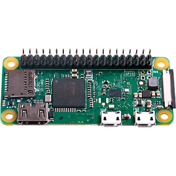
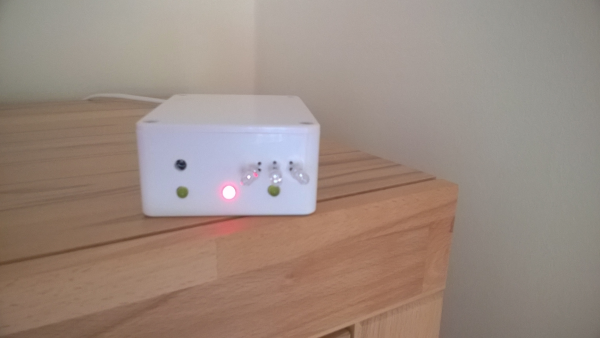
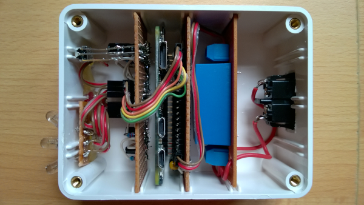

# py_irc
## Python infrared remote control utilities for Raspberry Pi ##

In the home theater, the devices (e.g. Bluray player, projector, monitor, amplifier, lights, etc.) are usually controlled with infrared remote controls. The problem is that the operation of these devices is completely different and separated. Each device is controlled with its own remote control. This turns the home theater into an uncomfortable, complex technical workplace like the flight deck of an airliner or like the control center in a nuclear power station.

You will surely agree with me that this is diametrically opposed to your intention to relax after a long day at work with a 3D nature documentary or a Bluray movie.

In order to optimize this situation, it is desirable to combine the individual operating procedures at the **push of a single button**, e.g.:
 * Play the movie with the projector on the white wall screen in a quiet sound mix
   * Configure the 4x4 4K [HDMI Matrix](images/hdmi_2.0_4k_matrix_4x4.jpg) to connect the devices:
     * Input: 4K Bluray Player
     * Output: 4K HDMI to analog 7.1 extractor
     * Output: Projector
   * Turn on the 4K projector
   * Turn on the 4K Bluray player
   * Enable 4K HDMI to analog 7.1 extractor
   * Switch on [dynamic range compressor](https://en.wikipedia.org/wiki/Dynamic_range_compression) 1 for channels FL, FR, CENTER, SUBW
   * Switch on [dynamic range compressor](https://en.wikipedia.org/wiki/Dynamic_range_compression) 2 for channels SL, SR, RL, RR
   * Switch 7 speakers and a subwoofer line-out to the analog amplifier
   * Switch on analog amplifier 7.1
   * Adjust the sound volume accordingly depending on the time of day
   * Switch the subwoofer off
   * Open the Bluray player drive
   * Wait until the user inserted a disk into the player drive 
   * Switch off the lights or roll down the blinds depending on the time of day and season

In the last weeks I integrated two new devices from Japan into my home theatre. This fails due to neither LIRC nor [irrp.py](https://github.com/souri-t/RemoteControl-RPI/blob/master/remote/bin/irrp) were able to learn the codes of the related infrared remote controls. 

So I spent a few hours to analyze the IR code sequences from LIRC/mode2. I discovered, that the second key press on the same key has another code than the first key press. I named this the **"double layer protocol"**.

Due I don't find Python code for this new challenge, I decided to create my own utilities and API-module.

Now these are successfully running on my home-brewed **"Infrared Remote Control API Server"**, I share here with you here.

## Hardware ##

My choice for this appliction is a a Raspberry Pi Zero W with headless Raspbian Buster based on Debian 10 Linux. 

It has the capacity to 
  * run Python3 (e.g. version 3.7)
  * learn and send the IR signals to the devices in the home theatre
  * communicate wireless on the home network (WiFi)
  * provide a web application based on middleware (e.g. [LAMP Stack](https://www.linuxbabe.com/debian/install-lamp-stack-debian-10-buster))
  * be administrated via SSH using PuTTY and WinSCP

The Raspberry Pi Zero W must be extended by the following components:
  * [IR Receiver circuit](irc_circuit/irc_circuit.pdf)
  * [IR Transmitter circuit](irc_circuit/irc_circuit.pdf)
  * MicroSD card
  * 5 V DC power supply
  * Optional: a Micro USB to RJ45 LAN adapter (to ensure minimal response time, if WLAN is jammed)

The complete device could look like this:

This prototype I have successfully in operation in my home theatre since November 2020.

As an expierienced DIY home automation expert, you shoud be capable to build this device easily, e.g. to have fun on a rainy weekend.

Please note:
The photo above shows an in-build switching power supply, which converts the power from 230V AC to 5V DC. This needs the skills of a licenced Ham Radio operator, electrician, electrical or electronic engineer. If you don't have these competence, you are strongly recommended to replace this by an commercially available plug-in power supply for Raspberry Pi with a low voltage power cord to the device. 

> Keep every time in mind that open voltages over 40 V (e.g. 110 V AC or 230 V AC from the power grid) could cause deadly injuries or fire.

Study the [schematic diagrams](irc_circuit/irc_circuit.pdf) and data sheets of my infrared remote control in the [irc_circuit folder](irc_circuit).
May this help you to find a way to design your own device. In the event that you want to adopt the circuit to your own needs or capabilities, I have also uploaded the files of my ["KiCad"](https://www.kicad.org/) project there.

The most effective point is at a height of 2 meters in a corner of the home theater, where there are no infrared controlled devices. For me this is on the top right of the filing cabinet where I put the DVD/Bluray collection.

## Software ##

Please note: The 3 Python files I share with you are only working on Debian based Linux on Raspberry Pi hardware and Raspbian Buster+ with Python 3.6+ and LIRC software installed and correctly configured and tested.

  * "irc_learn.py": This utility scans the key presses of the original IRC hardware and save these to a JSON data file.
  * "irc_send.py": This utility simulates the key presses of the original IRC hardware, which has been learned before by the "irc_learn.py." and saved to a JSON file.
  * "irc_api.py": An API module for Raspberry Pi, e.g. to send IR remote control codes via a TCP / IP service.

This software is backwards compatible JSON files you could have already generated by [irrp.py](https://github.com/souri-t/RemoteControl-RPI/blob/master/remote/bin/irrp). The key names and codes of these files will be automatically converted to the actual data model, used here. 

Many thanks to [Souri-T](https://github.com/souri-t) for his code. It made it easier for me to successfully get started with this topic.

The "irc_learn.py" uses the LIRC utility "mode2" only to get the temporal definition of the decoded IR signal. From my point of view, we get more precise result, when using a C-compiled program like "LIRC/mode2".

In sending IR signals with "irc-send.py", I use the same raw signal approach like "irrp.py". It is easy to use Raspberry Pi-internal features in Python to output a precise IR signal. 

But with this software I go beyond LIRC and "irrp.py". It is capable to precisely immitate the remote controls with double layer protocols, which are build for newer Japanese middle and high class consumer electronics devices.

Please use the "--help" parameter to get information about the features of the utilities.

The really smart module is "irc_api.py". Integrate it into a secure TLS TCP/IP daemon to receive IR signal requests from your home theatre web application.

I will explain this later.

... to be continued ...
